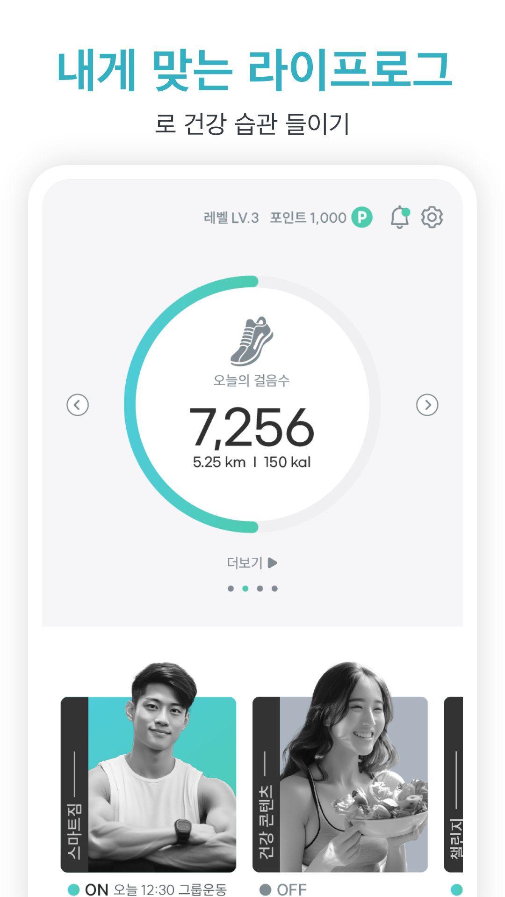
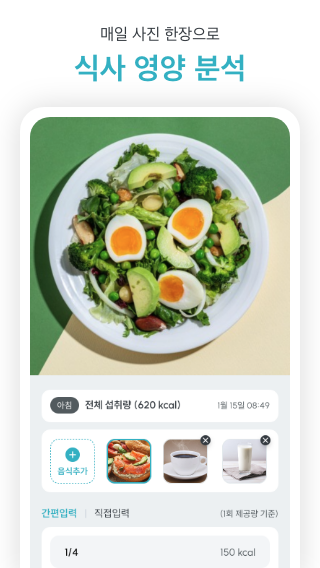

# [프로젝트] 건강관리 앱 - Invites (2024.02 ~ 2024.05 / 3개월)

## **Invites란?**
[Android App Store](https://play.google.com/store/apps/details?id=kr.co.hconnect.healthon.gena&hl=ko)

#### 운동 정보, 매 끼니 단/단/지를 쉽게 파악하는 등 '나'에게 맞춘 건강 가이드 앱입니다.

&nbsp;

### 개발한 기능 3가지

### 1. 운동정보 인디케이터
&nbsp;
&nbsp;
- 헬스라이브러리 제작 및 적용
- 혈압, 혈당 등 여러가지 원형그래프 페이징처리
- [그래프 라이브러리](https://github.com/Sorbh/kdGaugeViewFlutter) 커스텀
- [GetX](https://pub.dev/packages/get) 상태관리 라이브러리 사용

#### 성과
- 기존의 라이브러리를 fork하여 커스터마이징 하는 방법을 경험할 수 있었다.
- GetX 상태관리의 장단점을 알아볼 수 있었다.
  - 장점: 간단하게 Obx()를 이용하여 상태관리를 사용할 수 있다.
  - 단점: 무분별한 obs변수 사용은 프로젝트가 커질 수록 상태관리가 꼬일 수 있다.

### 2. 카메라 및 사진자르기 (음식분석AI)
&nbsp;
&nbsp;

#### 사용한 기술
- 플러터 [카메라 라이브러리](https://pub.dev/packages/camera) 적용
- 플러터 [이미지 크롭 라이브러리](https://pub.dev/packages/image_picker) 적용

#### 어려웠던 점
- 카메라 촬영 후 x, y 좌표를 통해 이미지를 자르는 수학적 계산을 해결 하였다.

### 3. 푸드렌즈 (음식분석AI)
&nbsp;
&nbsp;

#### 사용한 기술
- x, y 좌표를 통한 음식라벨 찍기
- 옵션에 따른 칼로리 계산

#### 성과
- [푸드렌즈](https://www.doinglab.com/home) 를 사용하여 음식정보 제공 서비스를 개발해볼 수 있었다.
- 좌표를 통해 처리해야 하는 복잡한 기능을 개발해볼 수 있었다.
